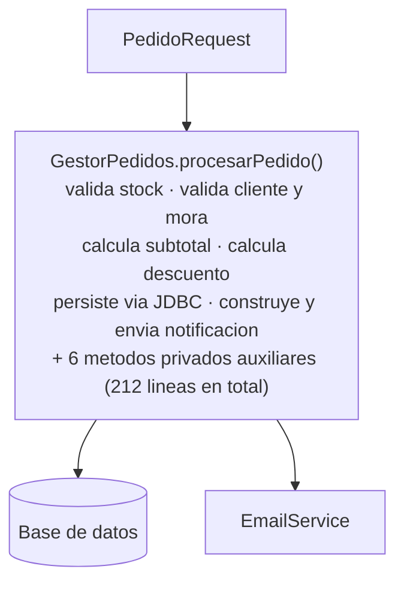
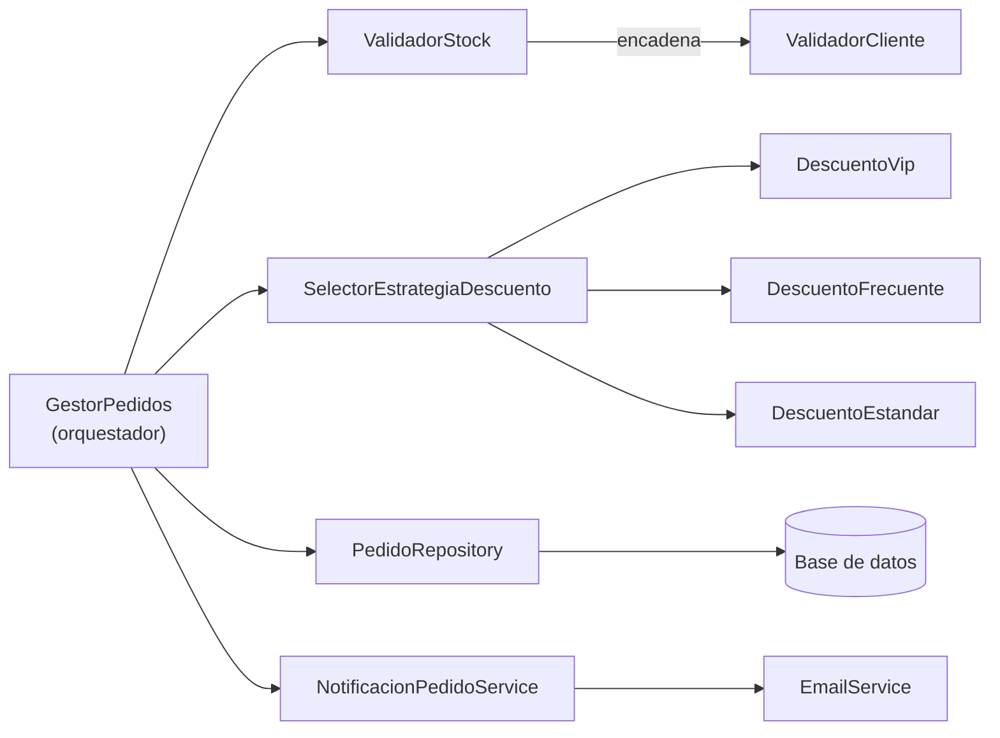
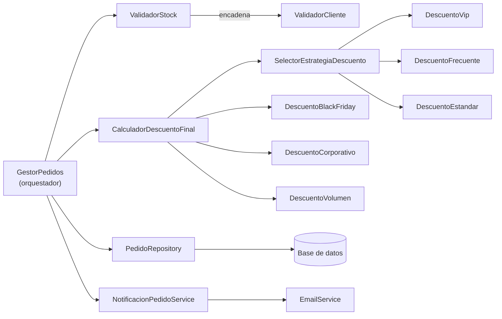

# Post-contenido — Unidad 6: Antipatrones de Diseño


-lightgrey?style=flat-square)


> Un sistema de gestión de pedidos que empezó concentrando, en una sola clase,
> todo lo que un antipatrón de diseño podía concentrar — y que, al crecer,
> tropezó con un segundo antipatrón distinto por reutilizar sin evaluar la
> solución que le había funcionado la primera vez.

## Contenido

- [Descripción](#descripción)
- [Arquitectura](#arquitectura)
- [Diagnóstico — Parte 1: `GestorPedidos`](#diagnóstico--parte-1-gestorpedidos)
- [Decisiones de diseño — Parte 1](#decisiones-de-diseño--parte-1)
- [Diagnóstico — Parte 2: las tres campañas](#diagnóstico--parte-2-las-tres-campañas-de-descuento)
- [Decisiones de diseño — Parte 2](#decisiones-de-diseño--parte-2)
- [Estructura del proyecto](#estructura-del-proyecto)
- [Cómo ejecutar](#cómo-ejecutar)
- [Pruebas](#pruebas)
- [Comparación antes/después de la salida](#comparación-antesdespués-de-la-salida)
- [Correcciones detectadas al ejecutar las pruebas](#correcciones-detectadas-al-ejecutar-las-pruebas)
- [Historial de commits](#historial-de-commits)
- [Herramientas utilizadas](#herramientas-utilizadas)
- [Conclusiones](#conclusiones)

## Descripción

Repositorio del post-contenido de la Unidad 6 de Patrones de Diseño de
Software — Sexto Semestre. Es un único proyecto Spring Boot (`pedidos-service`)
con dos partes que no indican de antemano qué antipatrón buscar:

- **Parte 1.** La clase `GestorPedidos` concentraba validación, cálculo de
  precios, persistencia vía JDBC y notificación en un solo método. Se
  diagnostica con evidencia citada del código (God Object y Spaghetti Code) y
  se corrige con `Chain of Responsibility` para las validaciones y `Strategy`
  para el descuento.
- **Parte 2.** El mismo proyecto crece con tres campañas de descuento que se
  agregaron como eslabones de la cadena de validación. Se diagnostica Golden
  Hammer y se corrige moviendo las campañas a `EstrategiaDescuento`.

El historial de commits sigue el orden real del trabajo: implementar,
diagnosticar y refactorizar, dos veces.

## Arquitectura

**Línea base — commit inicial.** Una única clase pública concentra seis
responsabilidades y conoce, al mismo tiempo, la base de datos, las reglas de
negocio y el formato del correo de confirmación.



**Después de la Parte 1.** `GestorPedidos` pasa de saberlo todo a coordinar
cuatro colaboradores, ninguno de los cuales conoce a los demás.



**Después de la Parte 2 (estado final).** Las tres campañas se resuelven junto
al descuento por tipo de cliente, no como eslabones adicionales de la cadena
de validación; `ValidadorPedido` conserva únicamente los dos eslabones que
justifican su uso.




## Diagnóstico — Parte 1: `GestorPedidos`

### El síntoma de fondo

`GestorPedidos.procesarPedido(PedidoRequest)` es el
**único método público de la clase**, y sin embargo concentra seis responsabilidades
que no tienen ninguna razón estructural para compartir un mismo método:

| # | Responsabilidad                          | Líneas      | Evidencia |
|---|-------------------------------------------|-------------|-----------|
| 1 | Validación de stock                       | 34–46       | Consulta SQL embebida (`SELECT stock FROM inventario...`) dentro de un `for` que recorre los ítems del pedido. |
| 2 | Validación de cliente y mora               | 49–68       | Dos consultas SQL más, con una regla de negocio (excepción por horario de corte, línea 60) mezclada en medio de la validación. |
| 3 | Cálculo de subtotal                        | 71–76       | Una consulta SQL **por cada ítem**, dentro del propio cálculo del precio. |
| 4 | Cálculo de descuento                       | 79–96       | Condicional anidado a dos niveles (tipo de cliente → rango de monto o número de pedidos previos), con una tercera consulta SQL embebida en la línea 89. |
| 5 | Persistencia directa vía JDBC              | 104–118     | Tres sentencias `INSERT`/`UPDATE` ejecutadas directamente contra `JdbcTemplate`, sin repositorio ni transacción explícita. |
| 6 | Notificación                               | 121–138     | Construcción manual del cuerpo del correo con `StringBuilder`, entremezclada con el envío y su manejo de errores. |

Es decir: **114 líneas** (29–142) de un único método público que pasa, sin ninguna
frontera, por cuatro capas de abstracción distintas —reglas de negocio, acceso a
datos, formato de texto y orquestación— todo al mismo nivel de anidamiento.

### No es solo un método largo: es una clase que ya "sabe demasiado"

El archivo no termina en la línea 142. Contiene además **seis métodos privados**
(`purgarPedidosVencidos`, `obtenerHistorialCliente`, `calcularImpuestoRegional`,
`formatearFactura`, `construirCuerpoCorreo`, `reintentarNotificacion`; líneas
152–211) que **procesarPedido invoca**, pero que no tienen relación con procesar
*un* pedido: limpieza programada de registros vencidos, historial de cliente para
un log de depuración, una segunda fórmula de impuesto que nunca se usa para cobrar
nada, una segunda implementación del cuerpo del correo que compite con la que ya
existe en línea, y una lógica de reintento recursiva. Dos observaciones adicionales,
citadas directamente del código:

- `purgarPedidosVencidos` (línea 158) borra pedidos en estado `PENDIENTE`, un
  estado que **el propio sistema nunca asigna** —todos los pedidos se insertan
  directamente como `CONFIRMADO` (línea 108)—, así que ejecuta una consulta contra
  la base de datos en cada pedido procesado para borrar sistemáticamente cero
  filas.
- `calcularImpuestoRegional` (línea 169) duplica, con una tasa parametrizable, el
  mismo 19 % que `procesarPedido` ya calcula de forma fija en la línea 98; conviven
  dos fuentes de verdad para el mismo número.

Esto es evidencia de que el problema no es únicamente un método largo: es una
clase que, con el tiempo, se convirtió en el lugar donde cualquier cosa remotamente
relacionada con "pedidos" terminó viviendo, tuviera o no relación con el flujo de
un pedido individual.

### Diagnóstico: God Object y Spaghetti Code combinados

Con la evidencia anterior, `GestorPedidos` presenta **dos antipatrones distintos y
simultáneos**, no uno solo:

- **God Object.** La clase viola directamente el Principio de Responsabilidad
  Única: valida, calcula, persiste, notifica y, además, hace limpieza de datos y
  mantiene una segunda ruta de cálculo/formato que nadie usa. No hay una única
  razón para que esta clase cambie; hay al menos seis.
- **Spaghetti Code.** El cálculo de descuento (líneas 79–96) anida condicionales
  según el tipo de cliente y, dentro de cada rama, según el monto o el número de
  pedidos previos, con una consulta SQL intercalada en medio de esa ramificación.
  Contando únicamente los puntos de decisión de `procesarPedido` (sin contar los
  operadores `&&`), el método tiene aproximadamente **16 caminos independientes**
  —una complejidad ciclomática cercana a 17—, muy por encima de un método que se
  pueda leer y probar con confianza.

### Qué se necesitaría para agregar un nuevo tipo de cliente hoy

Como ejercicio de diagnóstico: agregar un tipo de cliente nuevo con su propia
regla de descuento hoy exigiría (a) añadir una rama más al `if/else` de las
líneas 80–96, (b) sin tocar el resto del método, porque todo comparte el mismo
bloque; y como ese bloque no está cubierto por ninguna prueba unitaria aislada
—solo por pruebas de extremo a extremo sobre `procesarPedido` completo—, no hay
forma de verificar la nueva rama sin ejercitar también la validación de stock,
la validación de mora y la persistencia completa. Esa dependencia innecesaria
entre partes que no deberían conocerse es, en sí misma, el costo concreto del
antipatrón.


## Decisiones de diseño — Parte 1

> **Validación como Chain of Responsibility.** Se eligió `Chain of
> Responsibility` para la secuencia de validaciones, y no una lista de
> métodos booleanos invocados en orden, porque las validaciones tienen una
> dependencia real de orden y de corte anticipado: si `ValidadorStock`
> rechaza el pedido, `ValidadorCliente` ni siquiera debe ejecutarse. Una
> alternativa considerada fue un método `validarTodo()` con una lista de
> `Predicate<ContextoPedido>`, pero esa alternativa evalúa todos los
> predicados aunque el primero ya haya fallado, y no permite que un
> validador decida no delegar al siguiente — el corte anticipado que sí
> ofrece la cadena.

> **Descuento como Strategy y no como parte de la cadena.** Se eligió
> `Strategy`, y no un eslabón más de la cadena de validación, para el
> cálculo de descuento porque las reglas de descuento no tienen una
> dependencia de orden entre sí ni necesitan la posibilidad de "cortar" el
> flujo: siempre se aplica exactamente una regla, determinada por el tipo
> de cliente. Modelarlo como cadena habría obligado a introducir un
> mecanismo artificial para garantizar que solo un eslabón module el
> descuento, cuando un mapa de selección directa (`Strategy` +
> `SelectorEstrategiaDescuento`) resuelve el problema con menos indirección
> y sin condicionales.

> **Persistencia y notificación en clases propias.** `PedidoRepository` y
> `NotificacionPedidoService` se extrajeron sin cambiar ninguna sentencia
> `INSERT`/`UPDATE` ni la lógica de construcción del correo — el objetivo de esta parte
> es reubicar responsabilidades, no reescribir comportamiento. La
> alternativa de dejarlas como métodos privados de `GestorPedidos` (en
> lugar de clases inyectables) se descartó porque no habría reducido el
> número de razones que tiene la clase para cambiar, solo habría movido el
> código de sitio dentro del mismo archivo.

> **Eliminación de los seis métodos auxiliares.** `purgarPedidosVencidos`,
> `obtenerHistorialCliente`, `calcularImpuestoRegional`, `formatearFactura`,
> `construirCuerpoCorreo` y `reintentarNotificacion` no se migraron a
> ninguna de las cuatro capas nuevas: ninguno pertenece a validar, calcular
> el descuento, persistir o notificar *un* pedido. Migrarlos habría sido
> reproducir el God Object en miniatura dentro de una de las clases nuevas.
> Se eliminaron del proyecto — no se dejaron comentados — por la misma
> razón que se explica en la Parte 2: código que nadie invoca conscientemente
> es la semilla de un Lava Flow.

Con esta refactorización, comparar el tamaño de `GestorPedidos` es la
evidencia más directa del resultado: de **212 líneas** concentrando seis
responsabilidades, a un orquestador de unas 80 líneas sin ninguna regla de
validación ni de descuento, sin `StringBuilder` y con una sola consulta SQL (el
precio de cada ítem en `calcularSubtotal`, un paso de agregación trivial).

---

## Diagnóstico — Parte 2: las tres campañas de descuento

### El escenario

Dos semanas después de cerrada la Parte 1, mercadeo solicitó tres campañas
nuevas (`BLACK_FRIDAY`, `CORPORATIVO`, `VOLUMEN`). La solución que efectivamente
se integró al proyecto —commit anterior a este— fue agregar tres eslabones
más a la cadena de validación que ya existía: `PromocionBlackFriday`,
`PromocionCorporativo` y `PromocionVolumen`, encadenados después de
`ValidadorStock` y `ValidadorCliente`.

El código compila y las tres campañas funcionan. El problema, igual que en la
Parte 1, no es funcional: es de diseño. La pregunta que separa este commit del
anterior no es *"¿funciona?"*, sino *"¿es esta la herramienta correcta para
este problema, o es la herramienta que ya conocíamos?"*

### La evidencia: ninguna de las tres campañas necesita ser un eslabón

`Chain of Responsibility` se justificó en la Parte 1 por una propiedad
concreta: **las validaciones tienen una dependencia real de orden y de corte
anticipado** —si `ValidadorStock` rechaza, `ValidadorCliente` no debe
ejecutarse—. Las tres clases nuevas no comparten esa propiedad:

| Campaña | ¿Depende del orden frente a las otras? | ¿Alguna vez rechaza el pedido? |
|---|---|---|
| `PromocionBlackFriday` | No — solo lee una bandera de configuración | No, nunca |
| `PromocionCorporativo` | No — solo depende del NIT del cliente | No, nunca |
| `PromocionVolumen` | No — solo depende del total de unidades del propio request | No, nunca |

Ninguna de las tres necesita ejecutarse *después* de otra, ninguna necesita
la posibilidad de cortar la cadena, y ninguna implementa la única operación
para la que `ValidadorPedido` fue diseñado —decidir si el pedido continúa o
se rechaza (contrato heredado de la Parte 1)—. En cambio, las tres calculan
un porcentaje a partir de datos del pedido o del cliente: exactamente la
misma forma que ya tienen `DescuentoVip` y `DescuentoFrecuente`.

Una segunda pieza de evidencia, en el propio `ContextoPedido`: el campo
`descuentoCampana` y su método `aplicarDescuentoCampana` (que se queda con
"el mayor valor recibido") existen únicamente porque tres eslabones
necesitaban escribir en un lugar compartido sin poder devolver un valor
directamente —una señal de que se está forzando una responsabilidad de
*cálculo* dentro de un mecanismo pensado para *validar y cortar el flujo*.

### Diagnóstico: Golden Hammer

Esto es Golden Hammer, no un tercer God Object ni más Spaghetti Code: la
solución no se evaluó contra el problema nuevo, se reutilizó porque **ya
funcionó la vez anterior** ("los eslabones ya sabían cómo conectarse entre
sí" es, literalmente, la única justificación que motivó agregarlos así). El
costo no es visible de inmediato —el sistema funciona— sino que aparece en
el momento en que alguien intenta razonar sobre `ValidadorPedido`: una clase
cuyo nombre y contrato prometen "decidir si el pedido continúa" termina
conteniendo tres implementaciones que nunca deciden nada de eso.


## Decisiones de diseño — Parte 2

> **Strategy en vez de más eslabones de cadena.** Se corrigió modelando las
> tres campañas como `EstrategiaDescuento` y no como validadores de la
> cadena existente porque, igual que `DescuentoVip` y `DescuentoFrecuente`,
> calculan un porcentaje sin depender de un orden de evaluación ni
> necesitar la posibilidad de "cortar" el flujo del pedido — la propiedad
> que sí tienen `ValidadorStock` y `ValidadorCliente`. La alternativa de
> mantenerlas en la cadena fue descartada explícitamente por ser la causa
> del antipatrón diagnosticado: reutilizar una herramienta conocida sin
> verificar que el nuevo problema tuviera su misma forma.

> **`CalculadorDescuentoFinal` como único punto de combinación.** Se
> introdujo esta clase, en lugar de que `GestorPedidos` combinara
> directamente el `SelectorEstrategiaDescuento` con las tres campañas, para
> que la regla de negocio "se aplica el mayor descuento entre tipo de
> cliente y campañas activas" viva en un único lugar con nombre propio y
> sea comprobable de forma aislada — la misma regla que antes aplicaba
> `ContextoPedido.aplicarDescuentoCampana`, pero ahora sin un campo mutable
> compartido escrito por clases que no son responsables de validar nada.

> **Eliminar, no comentar, el código descartado.** Se eliminaron por
> completo `PromocionBlackFriday`, `PromocionCorporativo`,
> `PromocionVolumen` y el campo `descuentoCampana` en vez de dejarlos
> comentados como referencia histórica. Comentar código "por si se
> necesita después" es precisamente el mecanismo por el que nace un Lava
> Flow: nadie se atreve a borrarlo más adelante porque ya no queda claro
> si todavía cumple alguna función, y el historial de Git — no el código
> fuente activo — es el lugar correcto para conservar esa referencia.

**Equivalencia verificada, no solo asumida.** La suite de pruebas que
ejercita las tres campañas (`campanaCorporativo_clienteConNit`,
`campanaVolumen_masDeVeinteUnidades` y `CampanaBlackFridayTest`) se escribió
mientras las tres campañas todavía eran eslabones de la cadena, y **no
requirió ninguna modificación** después de moverlas a `Strategy` — ambas
implementaciones producen exactamente el mismo `total` para los mismos
casos, porque las pruebas verifican el comportamiento observable de
`GestorPedidos`, no los colaboradores internos que usa para lograrlo.

---

## Estructura del proyecto

```
pedidos-service/
├── pom.xml
└── src/
    ├── main/
    │   ├── java/com/tienda/pedidos/
    │   │   ├── PedidosServiceApplication.java
    │   │   ├── dto/
    │   │   │   ├── PedidoRequest.java
    │   │   │   ├── ItemPedido.java
    │   │   │   └── ResultadoPedido.java
    │   │   ├── validacion/                  Chain of Responsibility
    │   │   │   ├── ContextoPedido.java
    │   │   │   ├── ValidadorPedido.java
    │   │   │   ├── ValidadorStock.java
    │   │   │   └── ValidadorCliente.java
    │   │   ├── descuento/                    Strategy
    │   │   │   ├── EstrategiaDescuento.java
    │   │   │   ├── DescuentoVip.java
    │   │   │   ├── DescuentoFrecuente.java
    │   │   │   ├── DescuentoEstandar.java
    │   │   │   ├── DescuentoBlackFriday.java
    │   │   │   ├── DescuentoCorporativo.java
    │   │   │   ├── DescuentoVolumen.java
    │   │   │   ├── SelectorEstrategiaDescuento.java
    │   │   │   └── CalculadorDescuentoFinal.java
    │   │   └── service/
    │   │       ├── GestorPedidos.java        orquestador delgado
    │   │       ├── PedidoRepository.java
    │   │       ├── NotificacionPedidoService.java
    │   │       ├── EmailService.java
    │   │       └── ConsoleEmailService.java
    │   └── resources/
    │       ├── application.properties
    │       ├── schema.sql
    │       └── data.sql
    └── test/java/com/tienda/pedidos/
        ├── GestorPedidosIntegrationTest.java
        └── CampanaBlackFridayTest.java
```

## Cómo ejecutar

```bash
mvn spring-boot:run
```

Con la aplicación corriendo, la consola de H2 queda disponible en
`http://localhost:8080/h2-console` (JDBC URL `jdbc:h2:mem:pedidosdb`, usuario
`sa`, sin contraseña) para inspeccionar el esquema y los datos de prueba
descritos en `data.sql`.

```bash
mvn test
```

## Pruebas

| Escenario | Cliente de prueba | Resultado esperado |
|---|---|---|
| Stock insuficiente | 5 (ESTANDAR), producto 105 | Rechazado |
| Cliente inexistente | 9999 | Rechazado |
| Moroso con deuda, dentro/fuera del horario de corte | 4 (MOROSO) | Depende de la hora de ejecución (ver comentario en la prueba) |
| Moroso con deuda ya saldada | 6 (MOROSO) | Confirmado |
| Descuento VIP (monto alto / monto bajo) | 1 (VIP) | Confirmado, 15 % / 5 % |
| Descuento FRECUENTE (>10 / 4–10 pedidos previos) | 2 y 3 (FRECUENTE) | Confirmado, 8 % / 4 % |
| Sin ninguna regla de descuento | 5 (ESTANDAR) | Confirmado, 0 % |
| Campaña CORPORATIVO (cliente con NIT) | 7 (ESTANDAR + NIT) | Confirmado, 10 % |
| Campaña VOLUMEN (> 20 unidades) | 5 (ESTANDAR) | Confirmado, 12 % |
| Campaña BLACK FRIDAY (bandera activa) | 5 (ESTANDAR), contexto propio | Confirmado, 25 % |

Resultado de `mvn test` con la versión final: **Tests run: 12, Failures: 0,
Errors: 0** (11 en `GestorPedidosIntegrationTest` y 1 en
`CampanaBlackFridayTest`).

## Comparación antes/después de la salida

Los totales salen de `total = (subtotal − subtotal × descuento) × 1,19`. La
misma suite exige estos valores a todas las versiones del proyecto: el
`GestorPedidos` original, la refactorización de la Parte 1, la versión con los
tres eslabones de Golden Hammer y la versión corregida con `Strategy`. Las
pruebas no se modificaron al refactorizar; solo cambió el código que las
cumple.

| Caso | Subtotal | Descuento | Total esperado | Prueba presente desde | Resultado versión final |
|---|---:|---:|---:|---|---|
| Stock insuficiente (producto 105) | — | — | Rechazado | Commit 1 (original) | Rechazado ✔ |
| Cliente inexistente (9999) | — | — | Rechazado | Commit 1 (original) | Rechazado ✔ |
| VIP, subtotal alto | 1.800.000 | 15 % | 1.820.700 | Commit 1 (original) | 1.820.700 ✔ |
| VIP, subtotal bajo | 80.000 | 5 % | 90.440 | Commit 1 (original) | 90.440 ✔ |
| FRECUENTE, más de 10 pedidos | 150.000 | 8 % | 164.220 | Commit 1 (original) | 164.220 ✔ |
| FRECUENTE, 4 a 10 pedidos | 150.000 | 4 % | 171.360 | Commit 1 (original) | 171.360 ✔ |
| ESTANDAR, sin descuento | 80.000 | 0 % | 95.200 | Commit 1 (original) | 95.200 ✔ |
| Campaña CORPORATIVO (NIT) | 650.000 | 10 % | 696.150 | Commit 5 (Golden Hammer) | 696.150 ✔ |
| Campaña VOLUMEN (25 unidades) | 2.000.000 | 12 % | 2.094.400 | Commit 5 (Golden Hammer) | 2.094.400 ✔ |
| Campaña BLACK FRIDAY (activa) | 650.000 | 25 % | 580.125 | Commit 5 (Golden Hammer) | 580.125 ✔ |

Cada valor esperado se escribió junto con la versión "antes" (el `GestorPedidos`
original o los eslabones de Golden Hammer) y se mantuvo sin cambios en las
versiones "después". La columna de resultado es la ejecución actual de
`mvn test`. Las versiones anteriores comparten los tres errores de la sección
siguiente, que no cambian ninguna regla de negocio pero impedían ejecutarlas
sobre H2 2.x.

## Correcciones detectadas al ejecutar las pruebas

Al ejecutar la suite completa con Maven aparecieron tres errores que venían del
código base del enunciado y que no tienen relación con los antipatrones
diagnosticados. Se corrigieron sin cambiar ninguna regla de negocio:

1. **La cadena empezaba en el eslabón equivocado.** `encadenar(siguiente)`
   devuelve el eslabón *siguiente* (para poder escribir
   `.encadenar(a).encadenar(b)`), así que `primerValidador =
   stock.encadenar(cliente)` dejaba la cadena empezando en `ValidadorCliente` y
   `ValidadorStock` nunca se ejecutaba. Ahora se encadena primero y se asigna
   `stock` como cabeza de la cadena.
2. **Cliente inexistente.** `queryForObject` lanza
   `EmptyResultDataAccessException` cuando no hay ninguna fila; nunca devuelve
   `null`. `ValidadorCliente` usa ahora `query(...)` con un extractor que
   devuelve `null` si no hay fila, para llegar al rechazo "Cliente no
   registrado".
3. **`CALL IDENTITY()` no existe en H2 2.x** fuera del modo de compatibilidad
   LEGACY. `PedidoRepository` obtiene ahora el id generado con
   `GeneratedKeyHolder`, el mecanismo estándar de Spring JDBC; las sentencias
   `INSERT`/`UPDATE` no cambiaron.

## Historial de commits

| # | Mensaje | Qué documenta |
|---|---|---|
| 1 | `feat: implementar GestorPedidos...` | Línea base: God Object + Spaghetti Code, con su suite de pruebas de regresión |
| 2 | `docs: documentar diagnostico de God Object y Spaghetti Code...` | Diagnóstico de la Parte 1, con evidencia citada, **antes** de tocar el código |
| 3 | `refactor: extraer validaciones a Chain of Responsibility y descuentos a Strategy` | Las cuatro capas nuevas |
| 4 | `refactor: reducir GestorPedidos a orquestador delgado...` | `GestorPedidos` queda como coordinador |
| 5 | `feat: agregar 3 campanas de descuento como eslabones...` | El crecimiento del sistema que introduce Golden Hammer |
| 6 | `docs: diagnosticar Golden Hammer...` | Diagnóstico de la Parte 2, con evidencia citada |
| 7 | `refactor: mover las 3 campanas de la cadena de validacion a EstrategiaDescuento` | La corrección, y la eliminación (no comentado) del código descartado |
| 8 | `docs: completar README con decisiones de diseño de ambas partes y conclusiones` | Decisiones de diseño de ambas partes y conclusiones |
| 9 | `fix(validacion): conservar ValidadorStock como cabeza de la cadena...` | Correcciones 1 y 2 de la sección anterior |
| 10 | `fix(persistencia): obtener el id del pedido con GeneratedKeyHolder...` | Corrección 3 |
| 11 | `chore: quitar de los comentarios las referencias a las clases eliminadas...` | Sin rastro de `Promocion*` ni `descuentoCampana`, ni siquiera en comentarios |
| 12 | `docs: completar README con descripcion, comparacion antes/despues y correcciones` | Este commit |

## Herramientas utilizadas

- Java 17, Spring Boot 3.2.5, Spring JDBC, Maven, H2 Database (en memoria)
- JUnit 5 y Spring Boot Test para la suite de regresión
- Git y GitHub para el control de versiones e historial del diagnóstico

## Conclusiones

Los dos antipatrones de este repositorio comparten una misma causa raíz —una
decisión de diseño que fue razonable la primera vez y se repitió sin
reevaluarse— pero se manifiestan de forma opuesta: el God Object de la Parte
1 nace de *no separar* nada desde el principio, mientras que el Golden
Hammer de la Parte 2 nace de *separar exactamente igual que la vez anterior*,
sin verificar que el problema nuevo tuviera la misma forma. Ninguno de los
dos se detecta con una regla mecánica ("más de N líneas", "más de M
eslabones"); ambos exigieron volver a la pregunta de diseño original —¿qué
depende de qué, y por qué?— en lugar de repetir la última solución que
funcionó. La evidencia más útil que deja este ejercicio no es el código
final, sino la disciplina de exigir esa pregunta cada vez que el sistema
crece, incluso cuando la solución conocida "ya sabe cómo conectarse".
